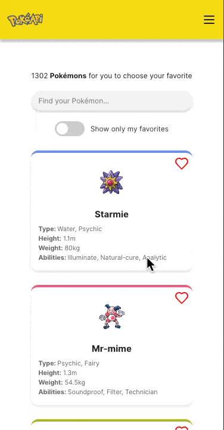
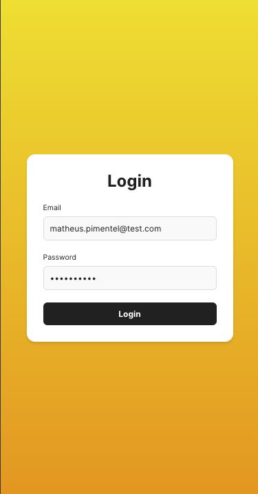
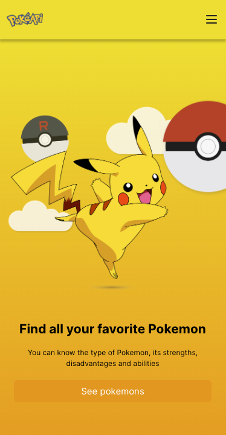
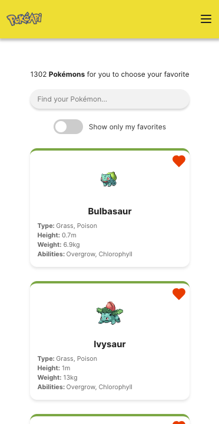
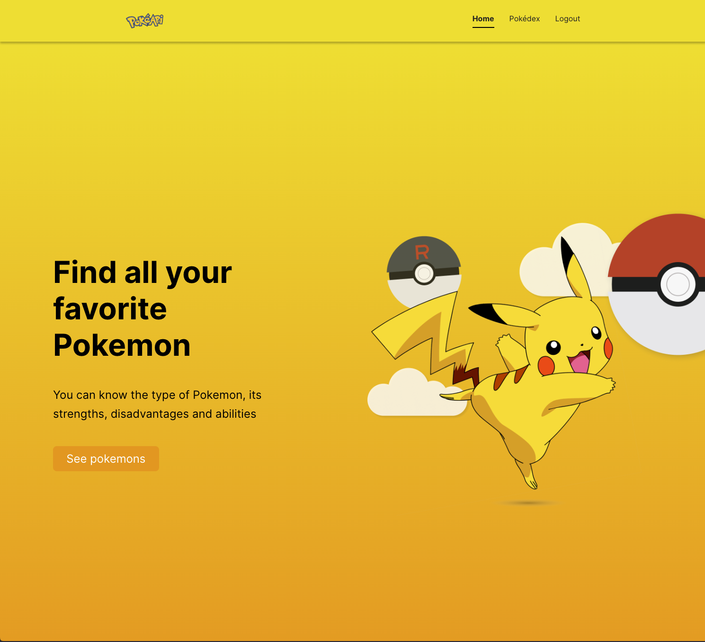
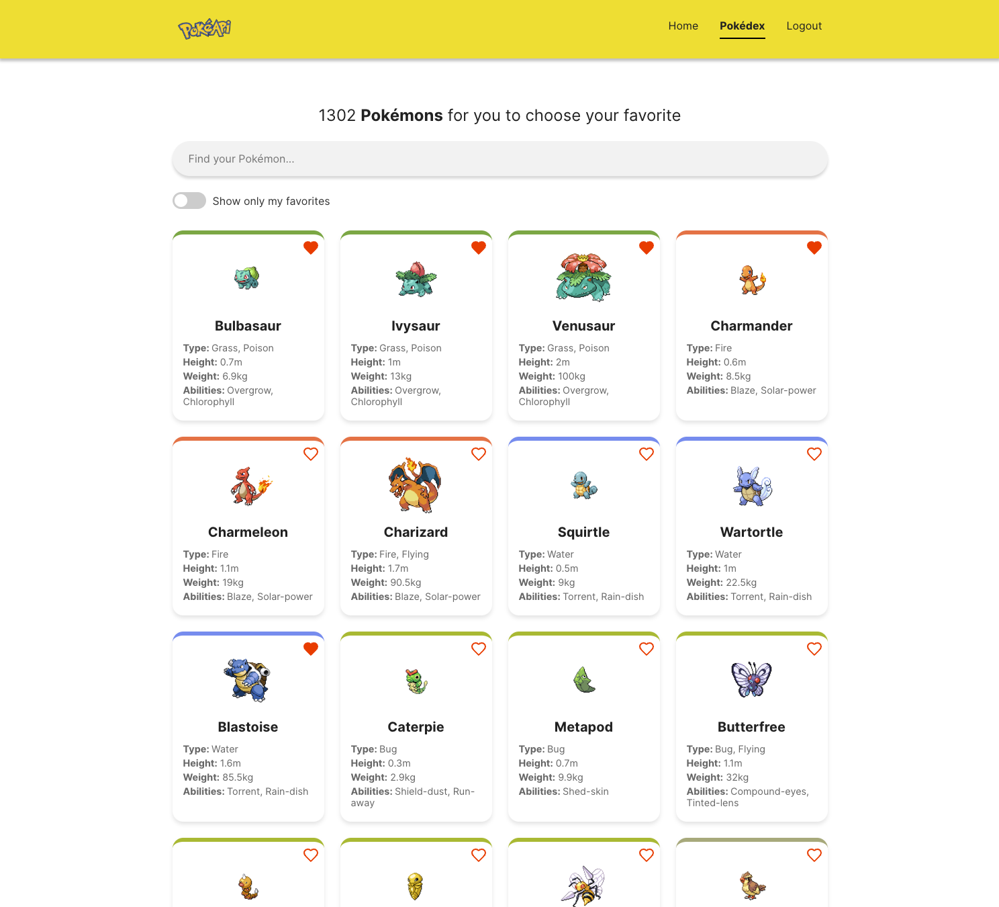

# Pokédex Frontend Project

Welcome to the Pokédex App! This is a modern and responsive web application for exploring Pokémon. You can search for your favorite Pokémon, toggle between favorites, and explore detailed information for each one.

---


---

## Table of Contents

- [Overview](#overview)
- [Features](#features)
- [Technologies Used](#technologies-used)
- [API](#api)
- [How to Run Locally](#how-to-run-locally)
- [Scripts](#scripts)
- [Responsiveness and Media](#responsiveness-and-media)

---

## Overview

This project demonstrates front-end skills by implementing:

- Responsive web design with a **mobile-first approach**.
- Integration with the [PokéAPI](https://pokeapi.co/) to fetch Pokémon data.
- **State management** using React hooks.
- **Custom hooks** for functionalities like pagination, favorites, and data fetching.
- **Debounced search** functionality to minimize API calls.
- Unit and integration tests using **Jest** and **React Testing Library**.

---

## Features

- View a paginated list of Pokémon.
- Search for Pokémon by name.
- Mark Pokémon as favorites (favorites are persisted in localStorage).
- Toggle to show only favorite Pokémon.
- Responsive design for desktop, tablet, and mobile screens.
- Skeleton loading placeholders while fetching data.
- A login page is already implemented, designed to handle authentication. Currently, it uses a mock token stored in localStorage, but it's ready to be extended with backend functionality.

---

## Technologies Used

### Key Libraries:

- **React.js**: Core framework for building the UI.
- **Vite**: Development server and build tool for fast performance.
- **TypeScript**: Strongly typed language for better code quality and maintainability.
- **React Router**: For navigation and routing.
- **React Testing Library** & **Jest**: For unit and integration testing.
- **Lucide Icons**: For elegant, customizable SVG icons.

### Styling:

- **CSS Modules**: To scope styles locally.
- **Mobile-First Design**: Ensuring a seamless experience across all devices.

### API:

- **PokéAPI**: External RESTful API used to fetch Pokémon data.

### Designs:

- **Figma**: Inspired on [This Figma](<https://www.figma.com/design/hwIReRpTGSJfC5idKZbzuq/Pokedex-(Community)?node-id=2-3&node-type=canvas&t=wkDPx6qjc2NAbf3W-0>).

---

## API

This project consumes data from the [PokéAPI](https://pokeapi.co/).

### Key Endpoints:

- `GET /pokemon?limit={limit}&offset={offset}`: Fetches a paginated list of Pokémons.
- `GET /pokemon/{name}`: Fetches detailed data for a specific Pokémons.

---

## **How to Run Locally**

### **1. Clone the Repository**

```bash
git clone git@github.com:MatheusCPimentel/frontend-test-rain.git
cd front-end-test-rain
```

### **2. Install Dependencies**

```bash
npm install
```

### **3. Start the Development Server**

```bash
npm run dev
```

The app will be available at **[http://localhost:5173](http://localhost:5173)**.

---

## **Scripts**

| Script            | Description                                    |
| ----------------- | ---------------------------------------------- |
| `npm run dev`     | Starts the development server.                 |
| `npm run build`   | Builds the app for production.                 |
| `npm run test`    | Runs all tests using Jest and Testing Library. |
| `npm run preview` | Previews the production build locally.         |

---

## Responsiveness and Media

The app was built with a **mobile-first approach** to ensure excellent usability across all screen sizes. Key breakpoints include:

- **Mobile**: Below `768px`

  

  
  
  

- **Desktop**: Above `1024px`

  

  
  
  
